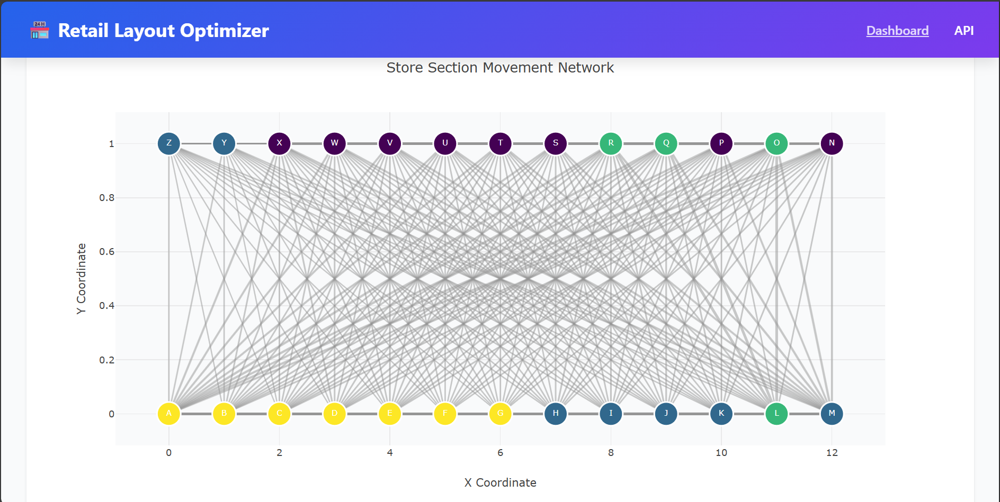
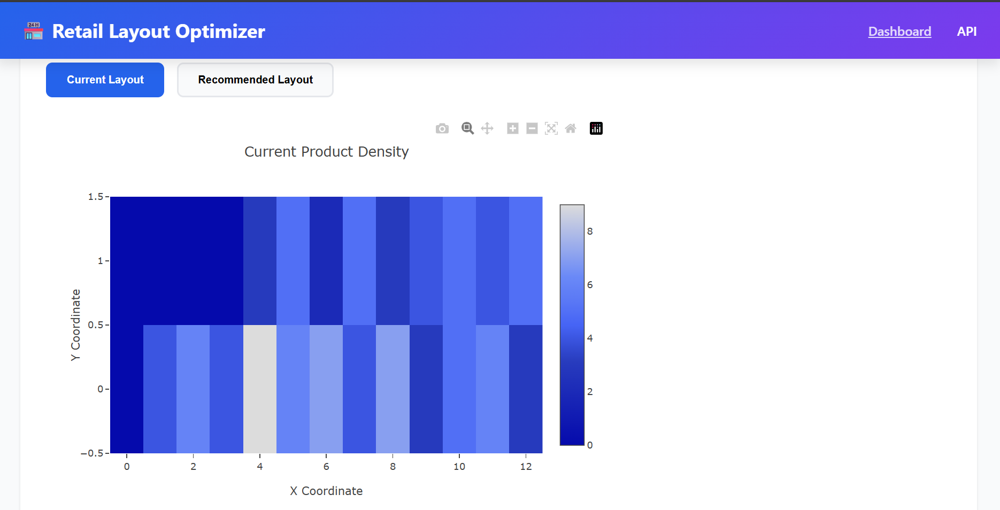

# Retail Store Layout Optimizer

A comprehensive data science and optimization system that analyzes customer movement patterns in retail stores to recommend optimal product placements. Built with Python, MySQL, Flask, NetworkX, and machine learning.

## 🎯 Project Overview

This system:
- **Analyzes** customer movement sequences through store sections  
- **Builds** weighted movement graphs to understand traffic patterns  
- **Detects** section communities using graph algorithms (Louvain/modularity)  
- **Clusters** products based on co-purchase behavior  
- **Optimizes** product placement to minimize customer walking distance  
- **Visualizes** results through an interactive web dashboard  

---

## 📸 Screenshots

### 🖥️ Dashboard Overview (Stats Section)


### 🔗 Movement Heatmap


### 📊 Recommendations Table


---

## 📋 Table of Contents

- [Features](#features)
- [Technology Stack](#technology-stack)
- [Prerequisites](#prerequisites)
- [Installation](#installation)
- [Configuration](#configuration)
- [Usage](#usage)
- [Project Structure](#project-structure)
- [Pipeline Workflow](#pipeline-workflow)
- [API Documentation](#api-documentation)
- [Testing](#testing)
- [Troubleshooting](#troubleshooting)
- [Assumptions](#assumptions)

---

## ✨ Features

### **Data Processing**
- Synthetic data generation for 10,000+ customer sessions  
- 100 products across 20 categories  
- 26 store sections in a 13×2 grid layout  
- Realistic movement patterns with community structure  

### **Graph Analysis**
- Weighted directed graph of section transitions  
- 650+ edges representing customer movements  
- Community detection using Louvain algorithm  
- Network visualization with Plotly  

### **Machine Learning**
- Product clustering using KMeans  
- Co-occurrence matrix from simulated transactions  
- Silhouette score optimization for cluster count  
- Typically finds 3–7 optimal clusters  

### **Optimization**
- Linear assignment (Hungarian algorithm)  
- Minimizes total walking distance  
- Considers product affinity and section communities  

### **Web Dashboard**
- Interactive network graph visualization  
- Heatmaps (current vs. optimized layout)  
- Searchable recommendations table  
- Real-time statistics  

---

## 🛠 Technology Stack

- **Python 3.11+**
- **MySQL 8.0+**
- **Flask 3.0**
- **SQLAlchemy 2.0**
- **NetworkX 3.2**
- **Scikit-learn 1.3**
- **SciPy 1.11**
- **Plotly 5.18**
- **Pandas 2.1**
- **NumPy 1.26**

---

## 📦 Prerequisites

### Required Software
- Python 3.11+  
- MySQL 8.0+  
- Visual Studio Code  

### Verify installation
```powershell
python --version
mysql --version
pip --version
